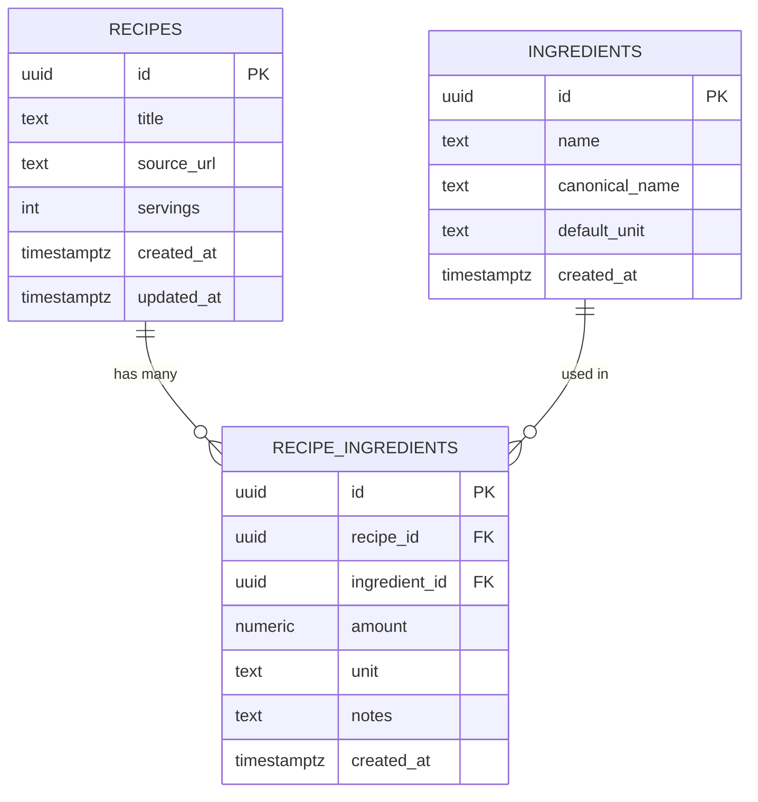

# 🛒🏃  Food  Run

*Smart meal prep and grocery planning from the recipes you already love.*

Food Run is a web app that helps home cooks turn a week’s worth of online recipes into a single, efficient bulk shopping trip. Paste in recipe links, confirm the ingredients, and Food Run will build a consolidated shopping list that respects your pantry, your portions, and (eventually) your budget.

> ***Live Demo:***  [https://morrisxelijah.github.io/food_run/](https://morrisxelijah.github.io/food_run/)

---

## Why Food Run?

Most people plan meals in tabs, not systems:

- Five recipes open across three different sites.
- Ingredients scattered across pages with slightly different names or units.
- Forgetting what’s already in the pantry and overbuying.
- Doing mental math for “double this recipe, halve that one” across the whole week.

Food Run aims to be the bridge between **how people actually find recipes** (blogs, TikTok, Instagram, big food sites) and **how they actually shop** (one grocery trip with a clear, realistic list).

---

## What Food Run Does

Food Run is designed for:

- **Home cooks and students** who batch cook or meal prep.
- **Busy professionals and parents** who want fewer grocery runs and less food waste.
- **Budget-conscious shoppers** who care about planning ahead and using what they already have.

At a high level, Food Run:

- Imports ingredients from recipe URLs.
- Normalizes ingredients into a structured format.
- Lets users confirm and edit those ingredients for accuracy.
- Combines multiple recipes into one consolidated shopping list.
- Adjusts that list based on pantry items the user already has.

---

## How It Works

1. **Paste recipe links**  →  Users paste one or more recipe URLs from supported sites. Food Run fetches the page content and extracts the recipe metadata and ingredient list.
2. **Confirm ingredients**  →  The app shows a structured ingredient list for each recipe. Users can:

   - Clean up ingredient names (e.g., “onion, chopped” → “yellow onion”).
   - Remove anything that doesn’t belong (pop-ups, odd text).
   - Add or tweak ingredients as needed.
3. **Plan portions**  →  Users choose which recipes they want to cook and how many portions they want for each.The app treats “servings” as a first-class factor when it calculates totals.
4. **Generate the shopping list**  →  Food Run aggregates ingredients across recipes into a single list, combining matching items where possible:

   - “2 cups rice” + “1 cup rice” → “3 cups rice”
   - “onion” appearing in multiple recipes → one line item with a higher quantity
5. **Adjust for pantry items**  →  Users can tell the app what they already have on hand (e.g., “2 cans black beans”, “1 bag of rice”). Food Run subtracts those from the shopping list with a small safety buffer, so users don’t end up short.
6. **Walk away with a clean list**
   The final output is a simple, readable shopping list that can be used on a phone in-store or printed on paper.

---

## Current Focus (MVP)

The current prototype is focused on building the core loop:

- Paste a recipe URL from at least one supported site.
- Parse and display the ingredient list for user confirmation.
- Save recipes and ingredients in a structured database.
- Select multiple recipes and apply a portion multiplier.
- Generate a consolidated shopping list from those recipes.

---

## Database Schema (MVP)

---

## Feature Roadmap

Food Run is intentionally scoped as a prototype with clear next steps:

- **Better UI / UX**

  - Embed pictures for each recipe and each ingredient.
  - Improve readability with spacing and styling.
- **Smarter ingredient handling**

  - Recognize equivalent ingredients (e.g., “scallions” vs “green onions”).
  - Recognize close substitutes (e.g., “flour tortillas” vs “corn tortillas”).
  - Handle unit conversions when combining items (cups, grams, ounces).
- **Pantry-based recommendations**

  - Let users describe what they already have in their kitchen.
  - Suggest recipes that are fully or mostly covered by existing pantry items.
  - Surface “minimal top-up” suggestions: *“If you buy just these 3 things, you can make all of this.”*
- **Meal prep planning**

  - Plan meal prep for X days or Y meals per week.
  - Automatically suggest combinations of recipes that fit those constraints and build a gap-filling shopping list.
- **Cost and calorie awareness**

  - Integrate pricing estimates using store-brand or average local prices.
  - Provide rough calorie + pricing estimates per recipe and per weekly plan.
- **Personal and “inspired by” recipes**

  - Let users clone imported recipes and add their own spin.
  - Support fully custom recipes (e.g., family recipes) that never originated as URLs.
- **Accounts and syncing (stretch)**

  - Basic authentication so users can persist recipes and pantry across devices.
  - Settings for dietary preferences or exclusions (e.g., vegetarian, nut-free).
- **Offline, 3rd-Party Integrations, and Automations  (stretch)**

  - Browser extension to add recipes to the database while browsing.
  - Save most recent activities for offline use.
  - Pintrest integration to add recipes from pinned collections to the database.
  - Integrations with online grocery stores to add ingredients from planned recipes / meal prep to the cart.
  - Integrations with fitness / wellness apps.

---

## Tech Stack

- frontend  →  typescript, react, vite, vanilla html + css
- backend  →  node, express, typescript, cheerio
- database  →  postgres (local for dev, supabase for prod)
- testing  →  vitest
